# Olá!

<!-- saudacao -->
🌤️ Boa tarde, seja bem-vindo!
<!-- /saudacao -->

Seja bem-vindo ao meu perfil!


```python
#!/usr/bin/python
# -*- coding: utf-8 -*-


class FullStackDev:
    def __init__(self):
        self.name = "Nicolas Trierveiler"
        self.role = "Full Stack Developer"
        self.languages = ["🇧🇷 Português", "🇺🇸 Inglês"]
        self.stack = ["Python", "JavaScript", "React", "Node.js", "SQL", "HTML/CSS"]

    def __str__(self):
        return f"{self.name} ({self.role})"

    def introduce(self):
        print(f"Olá! Eu me chamo {self.name} e atuo como {self.role}.")
        print(f"Idiomas: {', '.join(self.languages)}")
        print(f"Tecnologias favoritas: {', '.join(self.stack)}")
        print("Obrigado por visitar meu perfil! (•◡•)/")

if __name__ == "__main__":
    me = FullStackDev()
    print(me)
    me.introduce()

```


## 🔧 Technologies & Tools


## 📊 Stats

<p align="left">
  <br>
  
</p>


## 🏆 Certificações

- Google Cloud Certificate

## 🗂️ Projetos em Destaque


<a href="https://github.com/nictrierveiler/React-Ecommerce">
  
</a>