# Olá!

<!-- saudacao -->
☀️ E aí! Bom dia!
<!-- /saudacao -->

Seja bem-vindo ao meu perfil!


```python
#!/usr/bin/python
# -*- coding: utf-8 -*-


class FullStackDev:

    def __init__(self):
        self.name = "Nicolas Trierveiler"
        self.role = "FullStack Developer"
        self.language_spoken = ["pt_BR", "en_US"]

    def say_hi(self):
        print("Thanks for dropping by, hope you find some of my work interesting.")


me = FullStackDev()
me.say_hi()
```


## 🔧 Technologies & Tools


## 📊 Stats

<p align="left">
  <br>
  <br>
  
</p>


## 🏆 Certificações

## 🗂️ Projetos em Destaque

